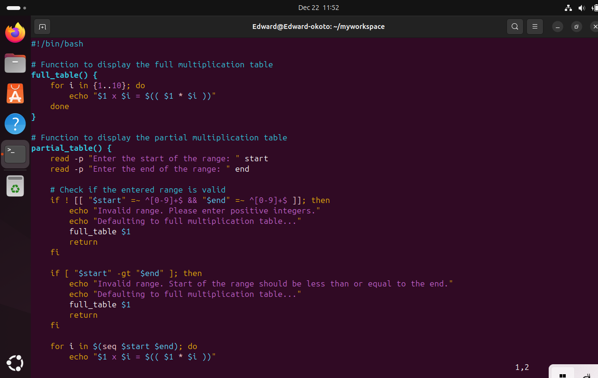
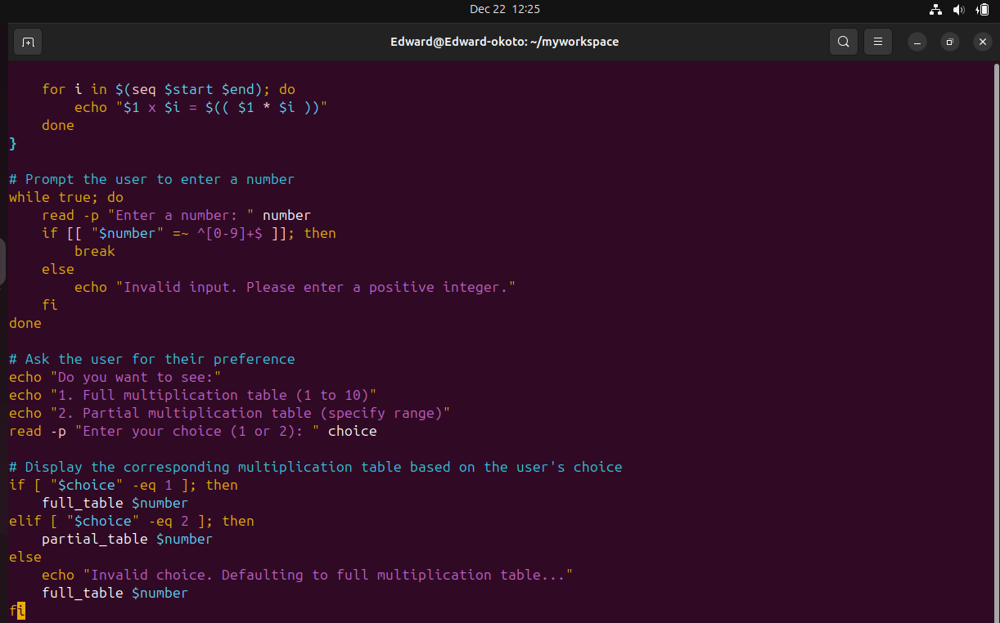
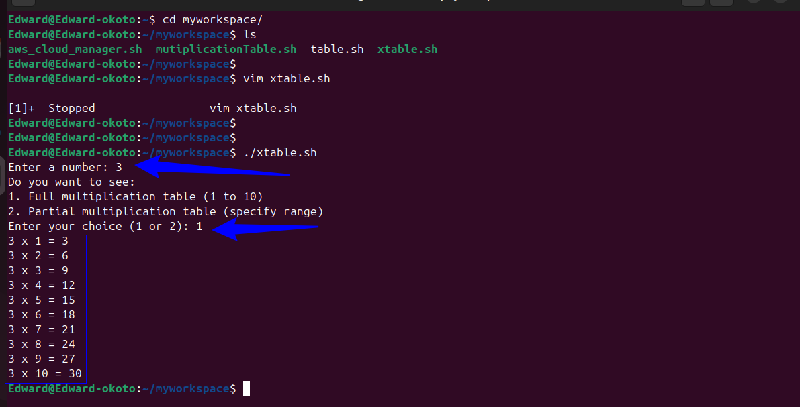
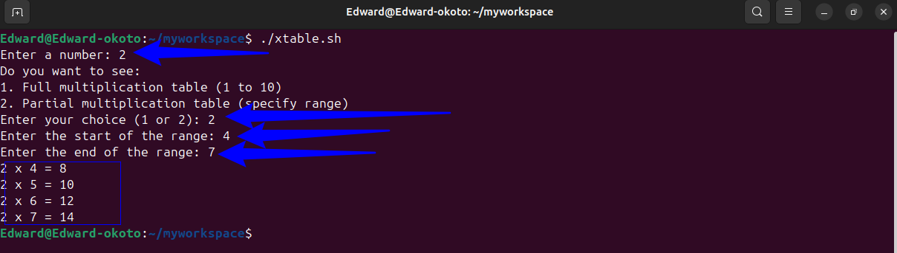
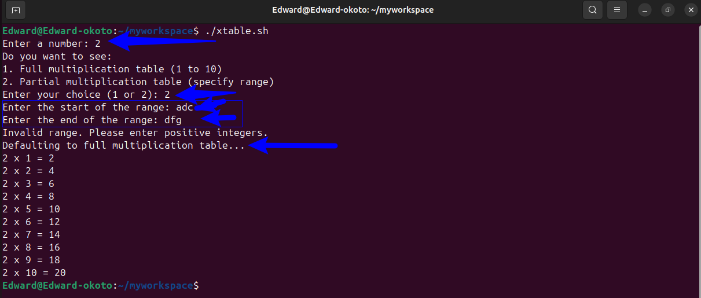
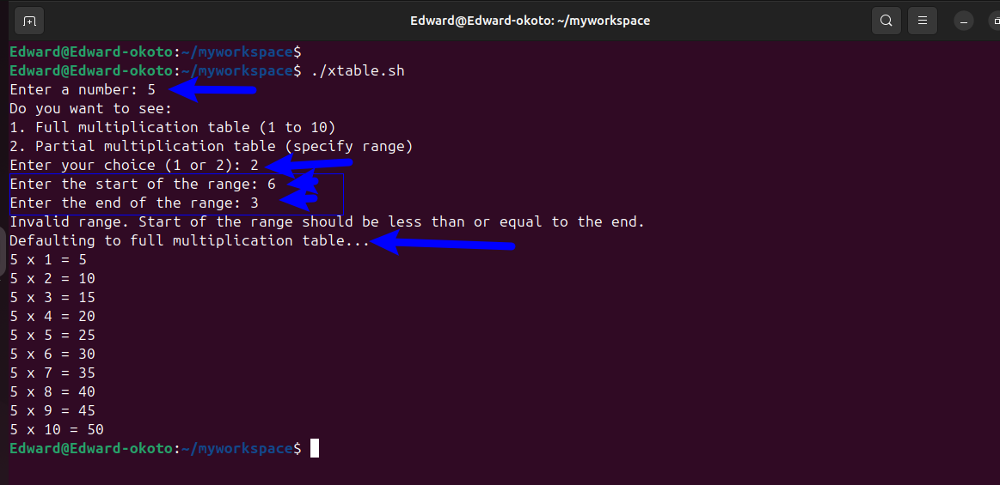
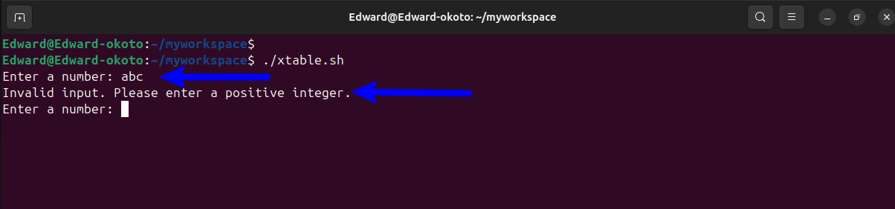
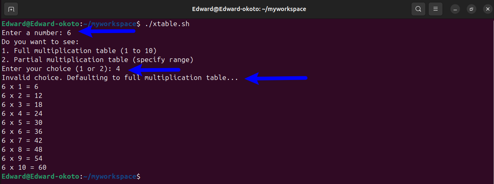

# Bash Script for Generating a Multiplication Table.

### Project Objective.
To create a Bash script that will generate a multiplication table for a number entered by the user.

### Project Description.
 The script will prompt a user to enter a number and then ask if they prefer to see the full multiplication table or a partial multiplication table.

 ### Project Requirement

 * **User Input for Numbers** : The Script must first ask the user to input a number from which a multiplication table will be generated.

 * **Choice of table range** : Next ask the user if they want the full multiplication table (1...10) or the partial table.If they chose partial, then prompt them for the start and end of the range.

 * **Use of Loops** : Implement the logic to generate the multiplication table using loops.

 * **Condition Logic** : Use if-else statement to handle the logic based on the users choice ( full or partial table and a valid range input)

 * **Input Validation** : Ensure that the users enter valid numbers for the multiplication table and the specified range and provide feedback for invalid input and default to the full table if the range is incorrect.

 * **Readable Output** : Display the multiplication table in a clear and readable format, adhering to the users choice of range.

 * **Comment and Code Quality** : Script should be well commented explaining the purpose of different sections and any important variable or logic used

 # PRACTICALS
 COMPLETE SCRIPT.

 
 
 

     #!/bin/bash

    # Function to display the full multiplication table
    full_table() {
        for i in {1..10}; do
            echo "$1 x $i = $(( $1 * $i ))"
        done
    }

    # Function to display the partial multiplication table
    partial_table() {
        read -p "Enter the start of the range: " start
        read -p "Enter the end of the range: " end
    
        # Check if the entered range is valid
        if ! [[ "$start" =~ ^[0-9]+$ && "$end" =~ ^[0-9]+$ ]]; then
            echo "Invalid range. Please enter positive integers."
            echo "Defaulting to full multiplication table..."
        full_table $1
        return
        fi
    
        if [ "$start" -gt "$end" ]; then
            echo "Invalid range. Start of the range should be less than or equal to the end."
            echo "Defaulting to full multiplication table..."
        full_table $1
        return
        fi

        for i in $(seq $start $end); do
            echo "$1 x $i = $(( $1 * $i ))"
        done
    }

    # Prompt the user to enter a number
    while true; do
        read -p "Enter a number: " number
        if [[ "$number" =~ ^[0-9]+$ ]]; then
            break
        else
            echo "Invalid input. Please enter a positive integer."
        fi
    done

    # Ask the user for their preference
    echo "Do you want to see:"
    echo "1. Full multiplication table (1 to 10)"
    echo "2. Partial multiplication table (specify range)"
    read -p "Enter your choice (1 or 2): " choice

    # Display the corresponding multiplication table based on the user's choice
    if [ "$choice" -eq 1 ]; then
        full_table $number
    elif [ "$choice" -eq 2 ]; then
        partial_table $number
    else
        echo "Invalid choice. Defaulting to full multiplication table..."
        full_table $number
    fi

# Script Breakdown
## Shibang
* This line is called a shebang. It indicates that the script should be run using the Bash shell.

      #!/bin/bash

## Function to display the full multiplication table
*  Function Definition: This block defines a function named `full_table`.

   * `full_table() { ... }`: The syntax for defining a function in Bash.

   * `$1`: Represents the first argument passed to the function.

* For Loop: Iterates through the numbers 1 to 10.

  * `for i in {1..10}; do ... done`: Loops through each number in the range 1 to 10.

  * `i`: A variable that holds the current number in the loop.

  * `echo "$1 x $i = $(( $1 * $i ))"`: Prints the multiplication of `$1` (the number) and `$i` (the current loop value).

        #Function to display the full multiplication table
        
        full_table() {
            for i in {1..10}; do
                echo "$1 x $i = $(( $1 * $i ))"
            done
        }
## Function to display the partial multiplication table
* Function Definition: This block defines a function named `partial_table`.

* Reading Input: Prompts the user to enter the start and end of the range.

  * `read -p "Enter the start of the range: " start`: Reads the start of the range and stores it in the variable start.

  * `read -p "Enter the end of the range: " end`: Reads the end of the range and stores it in the variable end.

* Input Validation: Checks if the entered range is valid.

  * `if ! [[ "$start" =~ ^[0-9]+$ && "$end" =~ ^[0-9]+$ ]]; then ... fi`: Ensures both `start` and `end` are positive integers.

  * `if [ "$start" -gt "$end" ]; then ... fi`: Ensures start is less than or equal to end.

* Fallback to Full Table: If the range is invalid, defaults to the full multiplication table by calling `full_table`.

* For Loop: Iterates through the specified range and prints the multiplication table.

  * `for i in $(seq $start $end); do ... done`: Loops through each number in the specified range using seq.

  * `i`: A variable that holds the current number in the loop.

  * echo `"$1 x $i = $(( $1 * $i ))"`: Prints the multiplication of $1 (the number) and `$i` (the current loop value).

        # Function to display the partial multiplication table
        partial_table() {
            read -p "Enter the start of the range: " start
            read -p "Enter the end of the range: " end
    
            # Check if the entered range is valid
            if ! [[ "$start" =~ ^[0-9]+$ && "$end" =~ ^[0-9]+$ ]]; then
                echo "Invalid range. Please enter positive integers."
                echo "Defaulting to full multiplication table..."
                full_table $1
                return
            fi
    
            if [ "$start" -gt "$end" ]; then
                echo "Invalid range. Start of the range should be less than or equal to the end."
                echo "Defaulting to full multiplication table..."
                full_table $1
                return
            fi

            for i in $(seq $start $end); do
                echo "$1 x $i = $(( $1 * $i ))"
            done
        }

## Prompt the user to enter a number
* Input Loop: Prompts the user to enter a number and ensures it is a valid positive integer.

  * `while true; do ... done`: A loop that runs indefinitely until a valid input is received.

  * `read -p "Enter a number: " number`: Prompts the user and stores the input in the variable `number`.

  * `if [[ "$number" =~ ^[0-9]+$ ]]; then ... fi`: Checks if the input is a positive integer.

  * `echo "Invalid input. Please enter a positive integer."`: Prints an error message if the input is invalid.

         # Prompt the user to enter a number
        while true; do
            read -p "Enter a number: " number
            if [[ "$number" =~ ^[0-9]+$ ]]; then
                break
            else
                echo "Invalid input. Please enter a positive integer."
            fi
        done

## Ask the user for their preference

* User Prompt: Asks the user if they want a full or partial multiplication table.

    * `echo "Do you want to see:"`: Prints a message.

    * `echo "1. Full multiplication table (1 to 10)"`: Option 1 for the full table.

    * `echo "2. Partial multiplication table (specify range)"`: Option 2 for the partial table.

    * `read -p "Enter your choice (1 or 2): " choice`: Reads the user's choice and stores it in the variable `choice`.

            # Ask the user for their preference
            echo "Do you want to see:"
            echo "1. Full multiplication table (1 to 10)"
            echo "2. Partial multiplication table (specify range)"
            read -p "Enter your choice (1 or 2): " choice
## Display the corresponding multiplication table based on the user's choice
* Conditional Logic: Executes the appropriate function based on the user's choice.

    * `if [ "$choice" -eq 1 ]; then ... fi`: Checks if the user's choice is `1` and calls `full_table`.

    * `elif [ "$choice" -eq 2 ]; then ... fi`: Checks if the user's choice is `2` and calls `partial_table`.

    * `else ... fi`: If the choice is invalid, prints an error message and defaults to the full multiplication table by calling `full_table`.

            # Display the corresponding multiplication table based on the user's choice
            if [ "$choice" -eq 1 ]; then
                full_table $number
            elif [ "$choice" -eq 2 ]; then
                partial_table $number
            else
                echo "Invalid choice. Defaulting to full multiplication table..."
                full_table $number
            fi

## Summary of Variables and Functions

### Variables:

* `i`: Loop variable in both `full_table` and `partial_table` functions.

* `start`: User input for the start of the range in the `partial_table` function.

* `end`: User input for the end of the range in the `partial_table` function.

* `number`: User input for the number to generate the multiplication table for.

* choice: User input for choosing between full and partial table.

### Functions:

* `full_table()`: Generates and prints the full multiplication table from 1 to 10 for the given number.

* `partial_table()`: Prompts the user for a range and generates the multiplication table within that range, defaulting to the full table if the range is invalid.

## TEST CARRIED OUT TO CHECK IF THE SCRIPT MEET REQUIREMENTS.
  Test 1. Entering a Valid Number and choosing full table.

  
 

  Test 2. Entering a Valid Number and choosing partial table.

  
 

  Test 3. Entering a Valid Number and choosing partial table with invalid Range (Non-integer).

  
 

  Test 4. Entering a Valid Number and choosing partial table with invalid Range (Start>End).
 

  Test 5. Entering an Invalid Number.
   

  Test 6. Entering an invalid Choice for table type.
    
